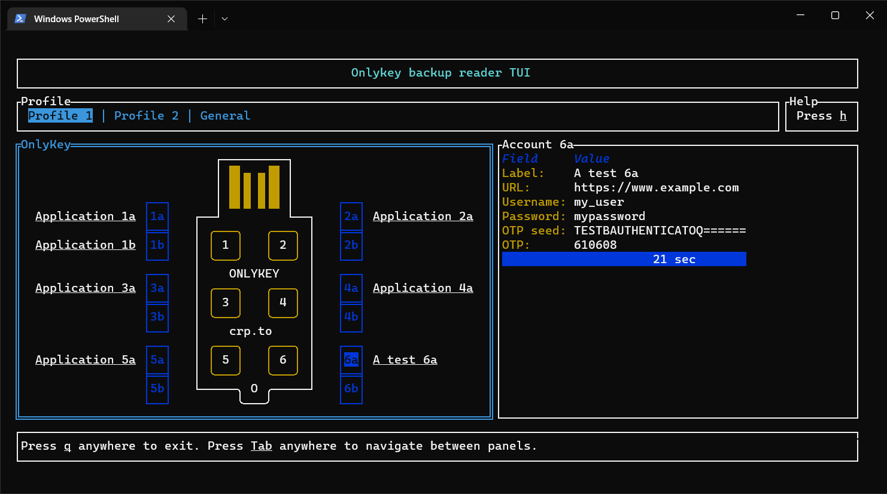

# OnlyKey backup reader TUI
[](https://github.com/SimonVareille/OnlyKey-backup-reader/actions/workflows/rust.yml)

Read and use an [OnlyKey](https://onlykey.io/) backup from the terminal [WIP].



## Summary

*OnlyKey backup reader* is a terminal user interface (TUI) application written in Rust that enables
you to view and use an OnlyKey's backup as if it was loaded on an actual OnlyKey.

In case you lost access to your OnlyKey and don't have a spare one available, you can use this
application as a **temporary** replacement.

This app won't modify the backup, but could create a new one in future improvements.

Backups for the OnlyKey Duo should work too, but not tested.

## Features

*OnlyKey backup reader* currently support and plan to support the following features.

### Backup decoding
- [x] Read passphrase-protected backup  
- [ ] Read ECC-protected backup
  - [x] With X25519 key
  - [ ] With NIST256P1 key
  - [ ] With SECP256K1 key
- [ ] Read RSA-protected backup  

### Data displayed

For both profiles:

- [x] Label
- [x] URL
- [x] Username
- [x] Password
- [ ] OTP
  - [x] OATH-TOTP (Google Authenticator)
  - [x] OATH-TOTP Seed
  - [ ] Yubikey OTP
  - [ ] Yubikey OTP Seed

For other data:

- [ ] ECC private keys
  - [x] X25519 (currently only the first 16 keys (101-116))
  - [ ] NIST256P1
  - [ ] SECP256K1
- [ ] HMACSHA1
- [ ] RSA private keys
- [ ] FIDO keys
- [ ] FIDO2 keys
- [ ] Yubikey Security info (Legacy)

## Usage
```
$ okbr.exe --help
okbr 0.1.0
svareille
A cross-platform OnlyKey backup reader

USAGE:
    okbr.exe [OPTIONS] <BACKUP>

ARGS:
    <BACKUP>    Path to the OnlyKey backup to load

OPTIONS:
    -h, --help       Print help information
    -q, --quiet      Less output per occurrence
    -v, --verbose    More output per occurrence
    -V, --version    Print version information
```

### Inside the TUI: 
- Navigate between panels with *Tab* and *Shift+Tab*.
- Use the keyboard's arrows to move inside a panel, and *Enter* to select selectable things.

Anywhere:
- Press *q* to immediately quit the app.
- Press *h* to display an help popup.
- Press *s* to toggle the visibility of secrets.
- Press *Escape* to quit current popup.

When a *profile* panel is on screen:
- Press *l* to copy the label into the clipboard.
- Press *U* to copy the URL into the clipboard.
- Press *u* to copy the username into the clipboard.
- Press *p* to copy the password into the clipboard.
- Press *o* to copy the OTP into the clipboard.
- Press *O* to copy the OTP seed into the clipboard.
  
When an ECC key is selected on the *general* panel:
- Press *k* to copy the private key into the clipboard.

## Security considerations

Using this app exposes both the backup and it's decryption key to the computer running it.
Therefore only use it as a last resort, and exclusively on a computer you fully trust.

However, this is as safe as loading both the backup key and the backup on an OnlyKey from the same
computer. For more security, load the backup key and the backup from two different computers. That
way, no device would knows both the backup and the key at the same time.
